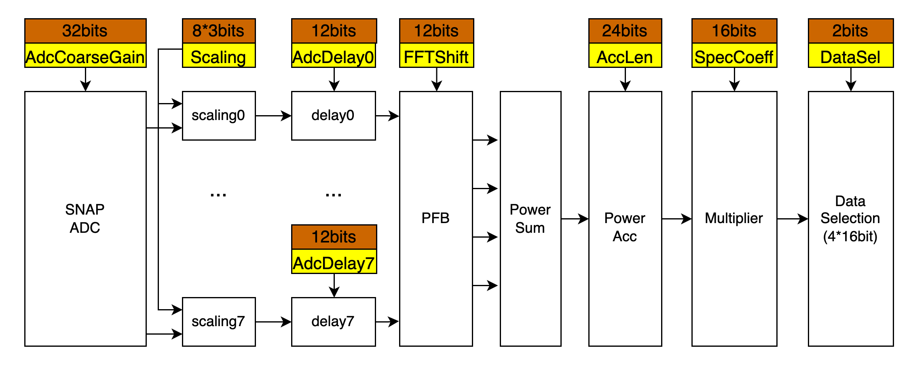

# SNAP board control
## Requirements
***[Miniconda3](https://docs.conda.io/en/latest/miniconda.html)*** is suggested for the control scripts.
1. [casperfpga](https://github.com/casper-astro/casperfpga/tree/py38)  
    You need to install py38 branch.  
2. other necessary packages
```
    pip install redis
    pip install matplotlib
    pip install scipy
    pip install jupyter
    pip install nbconvert
```
## Directory Structure
### ipynb
* snap_init.ipynb: This Jupyter Notebook is used for configuring SNAP board.  
* snap_adc.ipynb: This Jupyter Notebook is used for testing adcs on SNAP board.  
### scripts
* gen_py.sh: This script is used for generating python scripts from the above Jupyter Notebook.  
* snap_init.py and snap_adc.py: There are two python scripts, which are generated from the related *.ipynb files.  
* check_status.py: It's used for checking SNAP board status, inclduing ADC rms and clock frequency.  
You can run `python check_status.py -h` to get more options.
```
    (py38) ~limbo_scripts/scripts$ python check_status.py --all
    **************************************
    --SNAP Board IP:  192.168.2.100
    **************************************
    Fabric Clock Freq : 250.328834 MHz
      RMS of ADC_I : 10.398341
      RMS of ADC_Q : 15.032874
    **************************************
```
***NOTE:***  
1. Before running this script, please make sure the SNAP board has been **programmed**;
2. the default IP of SNAP board is `192.168.2.100`; 
3. the default port for SNAP board communication is `69`;
4. the default fpg file is `limbo_500_2022-12-03_1749.fpg`;

### fpg
The fpg files used in the scripts are here.  
### figures
limbo-block-diagram: It shows the registers used in the FPGA design. You can change these register values in the snap_init.py.  

## Getting Start
There are two ways to configure the SNAP board.
### Method1: Jupyter Notebook   
Go to ./ipynb, and then open snap_init.ipynb.  
Run the cells step by step.
### Method2: command line  
Go to ./scripts, and run
```
    python snap_init.py
```
